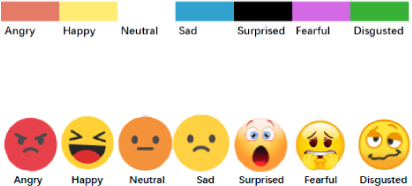

# Emotion-Detection-using-ML
This Emotion Detection Model analyzes text and predicts the emotion behind the sentence. It uses Natural Language Processing (NLP) and a Naïve Bayes classifier trained on labeled emotions. Simply enter a sentence, and the model will detect whether it expresses happiness, sadness, anger, surprise, or other emotions!
---

### README.md  

```md
# 🎭 Emotion Detection Using Machine Learning 😃😡😢

## 📌 Overview
This project is an **Emotion Detection System** that classifies facial expressions into categories such as **Angry, Happy, Neutral, Sad, Surprised, Fearful, and Disgusted** using **Machine Learning (ML)** models. The application is built using **Python, Streamlit, and Scikit-Learn**, and it utilizes a trained ML model for emotion classification.

## ✨ Features
✅ **Facial Expression Classification** 🎭  
✅ **Interactive Web App** 🌐 (Built using **Streamlit**)  
✅ **Pre-trained ML Model** 🤖 (`emotion_model.pkl`)  
✅ **Dataset Used** 📊 (`combined_emotion.csv`)  
✅ **Visualization with Emojis** 😃😡😢😲  

## 📂 Project Structure
```
📦 Emotion Detection Using ML
├── 📄 app.py                        # 🎯 Streamlit web app script
├── 📄 Emotion_Detection_Using_ML.ipynb # 📚 Jupyter notebook for ML model training
├── 📄 combined_emotion.csv           # 🗃️ Emotion dataset
├── 📄 emotion_model.pkl              # 🎭 Trained emotion detection model
├── 📄 requirements.txt               # 📦 Dependencies required for the project
├── 📄 Innomatics-Logo1.png           # 🏢 Innomatics Research Labs logo
└── 📄 ubicompiswc21adjunct-79-fig1.jpg # 🎨 Emotion category visualization
```

## 🔧 Installation

### 1️⃣ Clone the Repository 🖥️
```sh
git clone https://github.com/your-repo/emotion-detection.git
cd emotion-detection
```

### 2️⃣ Create a Virtual Environment (Optional but Recommended) 🏗️
```sh
python -m venv myenv
source venv/bin/activate   # On Mac/Linux 🍏🐧
myenv\Scripts\activate      # On Windows 🖥️
```

### 3️⃣ Install Dependencies 📦
```sh
pip install -r requirements.txt
```

## 🚀 Running the Application
```sh
streamlit run app.py
```
This will launch the web application in your browser. 🌍

## 🎓 Model Training (Optional)
To retrain the model, open `Emotion_Detection_Using_ML.ipynb` in **Jupyter Notebook** 📖 and execute the code cells.

## 🛠️ Technologies Used
- 🐍 **Python**
- 📊 **Scikit-Learn**
- 🌐 **Streamlit**
- 🏗️ **Pandas & NumPy**
- 📈 **Matplotlib & Seaborn**

## 📸 Screenshots


## 🏢 Credits
This project is developed under **Innomatics Research Labs**. 🏆

## 📜 License
This project is **open-source** under the **MIT License** 📝.

## 📞 Contact
## 👨‍💻 Developer: Amarendra Nayak
## 📧 Email: toamarendranayak@gmail.com
## 📞 Phone: +91-7008631814
## 🌐 LinkedIn: https://www.linkedin.com/in/amarendranayak/
```
